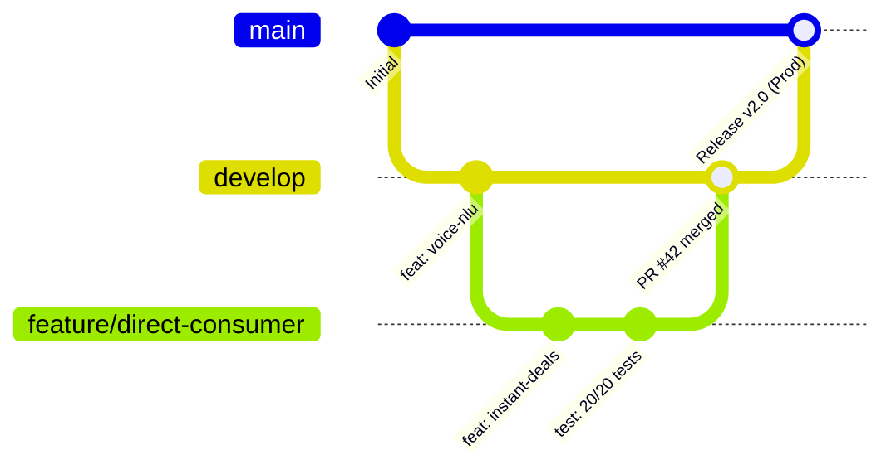

# 🛠️ Git Development Guide — FarmNexus

Welcome to the **FarmNexus** development workflow guide! This document outlines how to develop directly on Git, collaborate using branches and Pull Requests, use cloud development environments like **GitHub Codespaces**, and run dual-stack automated testing.

---

## 🌿 Git Branching Strategy

FarmNexus adheres to standard Git branching conventions:



| Branch | Description | CI/CD Action |
|---|---|---|
| **`main`** | **Production Releases**. Stable, production-ready code. | Triggers full verification & **Vercel Production Deployment**. |
| **`develop`** | **Active Integration Branch**. The default branch for daily development. | Triggers full verification & **Vercel Preview Deployment**. |
| **`feature/*`** | **New Feature Branches**. Created from `develop`. | Triggers CI automated tests upon Pull Request creation. |
| **`fix/*`** | **Bug Fix Branches**. Created from `develop`. | Triggers CI automated tests upon Pull Request creation. |
| **`hotfix/*`** | **Urgent Production Patches**. Created directly from `main`. | Merged into both `main` and `develop`. |

---

## ☁️ Cloud Development on GitHub

You can develop, build, and test FarmNexus entirely in the cloud without installing any local dependencies.

### 1. GitHub Codespaces (Full Cloud VS Code)

With pre-configured `.devcontainer/devcontainer.json`, Codespaces launches a complete cloud container pre-loaded with **Node.js 20**, **Python 3.12**, and **MongoDB 7.0**.

[](https://codespaces.new/ktrayanam/FarmNexus?ref=develop)

1. Click the **Open in GitHub Codespaces** button above or navigate to `https://codespaces.new/ktrayanam/FarmNexus?ref=develop`.
2. Codespaces automatically starts, installs all npm and python packages, and forwards ports:
   - **Port 3000**: FarmNexus React Frontend (Vite)
   - **Port 5050**: FarmNexus Backend API (Node Express / Python FastAPI)
   - **Port 8501**: FarmNexus Streamlit Python App
   - **Port 27017**: MongoDB Community Server
3. Start coding immediately inside the browser or your desktop VS Code!

### 2. GitHub Web Editor (`github.dev`)

For quick documentation, text changes, or minor fixes:
- Simply press the `.` (period) key while browsing the repository on GitHub, or visit:  
  `https://github.dev/ktrayanam/FarmNexus/tree/develop`

---

## 💻 Local Git Development Workflow

### Step 1: Clone and Checkout `develop`

```bash
# Clone the repository
git clone git@github.com:ktrayanam/FarmNexus.git
cd FarmNexus

# Switch to develop branch and pull latest changes
git checkout develop
git pull origin develop
```

### Step 2: Create a Feature Branch

Always branch off `develop`:

```bash
git checkout -b feature/your-feature-name
```

### Step 3: Install Dependencies

```bash
# Install root, backend, and frontend Node dependencies
npm install
cd backend && npm install
cd ../frontend && npm install
cd ..

# Install Python dependencies
pip install -r requirements.txt
```

### Step 4: Run Development Services

Choose your preferred stack:

#### Node.js + React Stack:
```bash
# Terminal 1: Node.js Backend (Port 5050)
node backend/server.js

# Terminal 2: React Frontend (Port 3000)
cd frontend && npm run dev
```

#### Python FastAPI + Streamlit Stack:
```bash
# Terminal 1: Python FastAPI Backend (Port 5050)
./run_python.sh api

# Terminal 2: Pure Python Streamlit App (Port 8501)
./run_python.sh web
```

---

## 🧪 Dual-Stack Verification & Automated Testing

Before committing or submitting a PR, verify that all automated tests pass:

### 1. Node.js Test Suite (20/20 Tests):
```bash
npm test
```
*Validates: System Health, Auth/RBAC, Voice NLU, Stock In/Out/Adjustments, Smart Alerts, AI Crop Doctor, Mandi Intelligence, Direct Marketplace, Cold Storage, Logistics Freight, Offline Sync, FPO Pooling, Storage Cancellation, Logistics Tracking, Price Calibration, and Direct Consumer Contracts.*

### 2. Python Test Suite (20/20 Tests):
```bash
python3 backend_python/test_suite.py
# OR
./run_python.sh test
```

### 3. Frontend Production Build Check:
```bash
npm run build
```

---

## 📦 Committing Changes & Creating Pull Requests

### 1. Follow Conventional Commit Style:

```bash
git add .
git commit -m "feat(marketplace): add instant direct consumer contract confirmation"
```

Common prefixes:
- `feat:` A new user-facing feature or module capability
- `fix:` A bug fix or error resolution
- `test:` Adding or updating automated tests
- `docs:` Documentation additions or updates
- `refactor:` Code improvements without changing functionality

### 2. Push to GitHub Remote:

```bash
git push -u origin feature/your-feature-name
```

### 3. Open a Pull Request:

1. Go to `https://github.com/ktrayanam/FarmNexus/pulls`
2. Click **New Pull Request**
3. Set base repository: **`base: develop`** $\leftarrow$ **`compare: feature/your-feature-name`**
4. Describe your changes and link any related issues.
5. GitHub Actions (`.github/workflows/vercel.yml`) will automatically run the 20/20 Node test suite, the 20/20 Python test suite, and generate a Vercel preview deployment.
6. Once checks pass and review is approved, merge into `develop` using **Squash and Merge**.

---

## 🚀 Releasing to Production (`main`)

When features in `develop` are ready for a production release:

```bash
# Switch to main
git checkout main
git pull origin main

# Merge develop into main
git merge develop --no-ff -m "chore(release): merge develop into main for v2.0 production release"

# Push to GitHub main (triggers Vercel production deployment)
git push origin main
```
